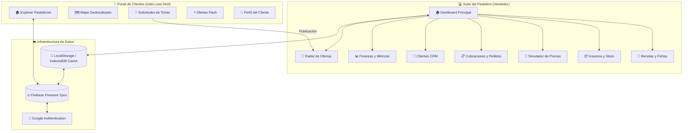
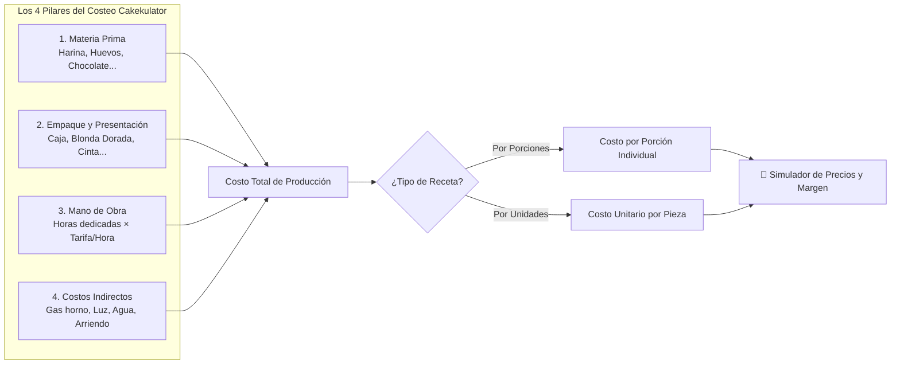
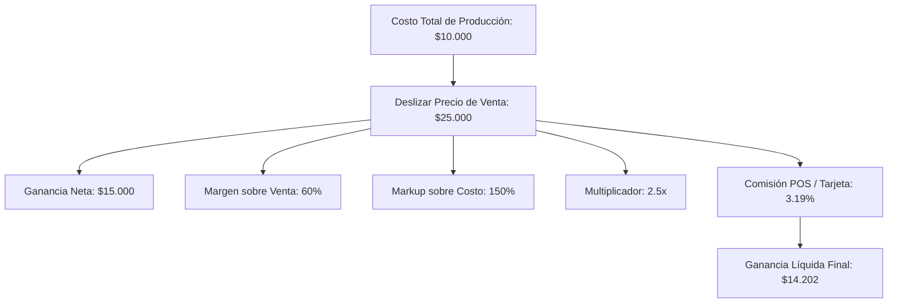
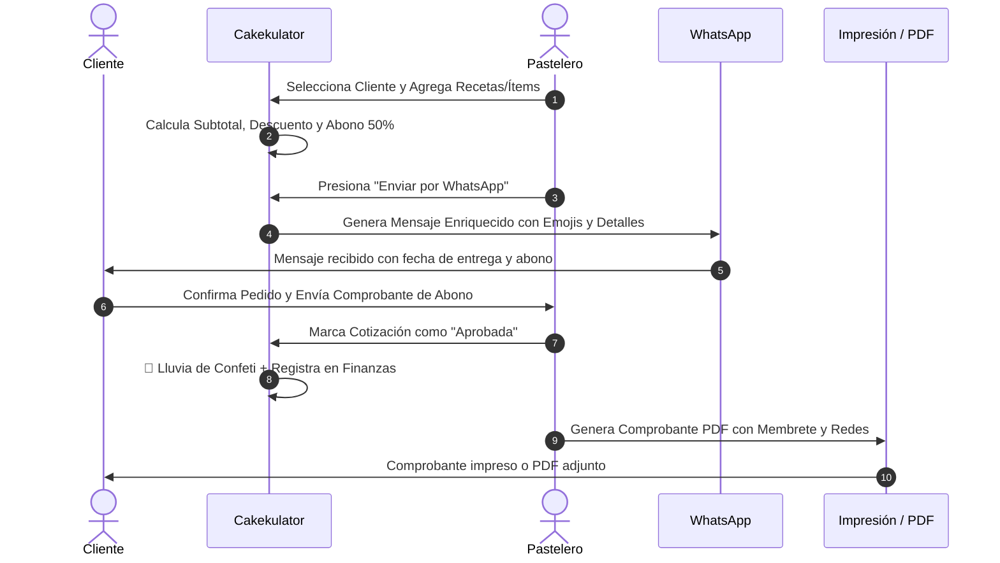
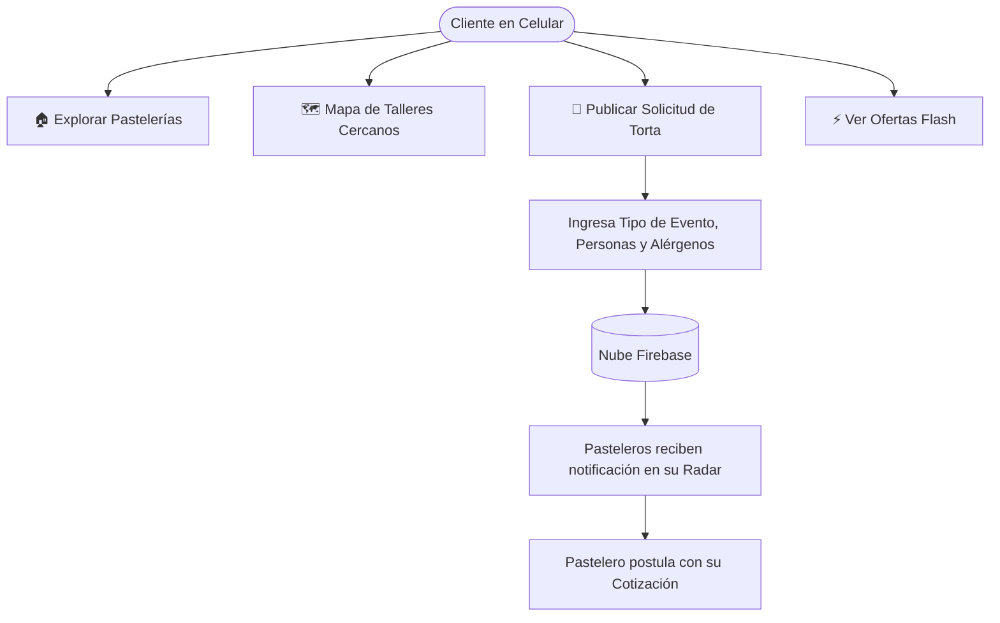

# 🧁 Manual de Usuario Oficial - Cakekulator

Bienvenido a **Cakekulator**, la suite integral de costeo, gestión comercial y pedidos diseñada especialmente para pasteleros, reposteros y emprendedores gastronómicos.

Este manual explica detalladamente cómo utilizar cada funcionalidad del sistema, acompañado de diagramas de flujo interactivos, ejemplos prácticos de cálculo y consejos para maximizar la rentabilidad de tu negocio.

---

## 📑 Tabla de Contenidos
1. [Visión General y Arquitectura del Sistema](#1-visión-general-y-arquitectura-del-sistema)
2. [Catálogo de Insumos, Mermas y Escáner de Boletas OCR](#2-catálogo-de-insumos-mermas-y-escáner-de-boletas-ocr)
3. [Fichas Técnicas y Costeo Integral de Recetas](#3-fichas-técnicas-y-costeo-integral-de-recetas)
4. [Simulador Dinámico de Precios y Rentabilidad](#4-simulador-dinámico-de-precios-y-rentabilidad)
5. [Generador de Cotizaciones, WhatsApp y PDF](#5-generador-de-cotizaciones-whatsapp-y-pdf)
6. [CRM de Clientes y Fechas Especiales](#6-crm-de-clientes-y-fechas-especiales)
7. [Radar de Ofertas, Supermercados y Geolocalización](#7-radar-de-ofertas-supermercados-y-geolocalización)
8. [Portal de Clientes y Solicitudes de Pedidos](#8-portal-de-clientes-y-solicitudes-de-pedidos)
9. [Finanzas, Métricas y Flujo de Caja](#9-finanzas-métricas-y-flujo-de-caja)
10. [Gestos Móviles, PWA Offline y Sincronización en la Nube](#10-gestos-móviles-pwa-offline-y-sincronización-en-la-nube)

---

## 1. Visión General y Arquitectura del Sistema

Cakekulator opera bajo una arquitectura **PWA Offline-First** conectada con Firebase Cloud Firestore. Puedes trabajar sin conexión en tu taller o cocina; todos los datos se guardan en tu dispositivo y se sincronizan automáticamente con la nube cuando vuelves a tener internet.

---

## 2. Catálogo de Insumos, Mermas y Escáner de Boletas OCR

El catálogo de insumos es el cimiento de todos tus cálculos. Cada ingrediente o empaque que compras se registra con su formato de empaque comercial y su porcentaje de merma.

### ¿Cómo registrar un insumo manualmente?
1. Ve al módulo **📦 Insumos** y presiona **"+ Nuevo Insumo"**.
2. **Nombre:** Ingresa el nombre claro (ej. *Harina de Trigo Especial*).
3. **Categoría:** Selecciona si es *Harinas y Féculas*, *Lácteos*, *Chocolates*, *Empaques*, etc.
4. **Formato de Compra:**
   - **Cantidad:** ej. `1000`
   - **Unidad:** `g` (gramos), `kg` (kilos), `ml` (mililitros), `L` (litros) o `u` (unidades).
   - **Precio de Compra:** Valor total pagado (ej. `$1.400`).
5. **Merma / Desperdicio (%):** Porcentaje de materia prima que se pierde al procesar (ej. un 12% en cáscaras de plátano, 5% en recortes de mantequilla).
6. Cakekulator calcula en tiempo real el **Costo Real por Unidad Base** aplicando la fórmula:
   $$\text{Costo Base Real} = \frac{\text{Precio}}{\text{Cantidad}} \times \left(1 + \frac{\text{Merma \%}}{100}\right)$$

### 🧾 Escáner Inteligente de Boletas / Facturas (OCR)
1. Presiona el botón **"🧾 Escanear Boleta OCR"**.
2. Puedes tomar una foto directamente con la cámara de tu celular o cargar una foto/PDF de tu recibo de compra.
3. El motor OCR procesa el documento y lista los ítems detectados con sus precios.
4. Puedes marcar qué ítems deseas actualizar (ej. si la mantequilla subió de precio) o crearlos como nuevos insumos en un solo toque.

---

## 3. Fichas Técnicas y Costeo Integral de Recetas

Un error común en la pastelería tradicional es costear únicamente la harina, los huevos y el azúcar. Cakekulator implementa el **Método Integral de 4 Factores**, asegurando que no regales tu trabajo ni tus costos fijos.

### Paso a paso para crear una Ficha Técnica:
1. Ve a **🎂 Recetas** y toca **"+ Nueva Receta"**.
2. **Tipo de Rendimiento:**
   - **Por Porciones (Tortas enteras):** Ingresa la cantidad de porciones que rinde el molde (ej. Molde 22 cm = *20 porciones*).
   - **Por Unidades (Repostería individual):** Ingresa cuántas unidades rinde la tanda (ej. *24 alfajores* o *12 cupcakes*).
3. **Materia Prima:** Busca tus insumos guardados, escribe la cantidad requerida (ej. 450 g de Harina) y el sistema convertirá automáticamente unidades de medida y aplicará mermas.
4. **Empaques:** Añade caja, blonda dorada, sticker de tu marca y cinta decorativa.
5. **Mano de Obra:** Ingresa las horas dedicadas (ej. 2.5 hrs). El valor por hora se toma automáticamente de tus Ajustes o puedes personalizarlo.
6. **Costos Indirectos:** Puedes ingresar un monto fijo o un porcentaje estimado sobre la receta (ej. $1.800 por concepto de gas y energía).
7. **Escalado Inteligente de Recetas:** Si tienes una receta para 15 personas y un cliente te pide una para 30, toca **"⚖️ Escalar Receta"**, indica 30 porciones y todos los ingredientes se multiplicarán proporcionalmente al instante sin errores de cálculo.

---

## 4. Simulador Dinámico de Precios y Rentabilidad

El simulador te permite ver con absoluta claridad qué porcentaje de cada venta te queda libre de ganancia neta en tu bolsillo.

### Funciones Principales del Simulador:
- **Slider en Tiempo Real:** Mueve el control y observa cómo el medidor de rentabilidad cambia de color:
  - 🟢 **Verde Esmeralda (≥ 40% Margen):** Rentabilidad excelente y saludable.
  - 🟡 **Ámbar (20% a 39% Margen):** Rentabilidad moderada, cubre costos pero deja poco colchón.
  - 🔴 **Rojo (< 20% Margen):** Zona de riesgo comercial o pérdida encubierta.
- **Sugeridor por Margen Meta:** Si quieres ganar obligatoriamente un 45% limpio, escribe `45` en el campo de margen deseado y Cakekulator calculará el precio de venta exacto al centavo.
- **Comisiones de Tarjetas / Pasarelas de Pago:** Activa la casilla de Redelcom, Transbank o Mercado Pago para descontar automáticamente la comisión financiera antes de dar tu precio.
- **Matriz de Proyección de Ventas:** Visualiza tus ingresos y utilidades si vendes 10, 50, 100 o 250 unidades al mes de este producto.

---

## 5. Generador de Cotizaciones, WhatsApp y PDF

Transforma tus recetas y productos en propuestas comerciales listas para cerrar ventas.

### Campos destacados de la cotización:
- **Cálculo de Abono (50% por defecto):** Asegura tu materia prima antes de prender el horno indicando con claridad el anticipo requerido y el saldo contra entrega.
- **Fecha y Hora de Entrega:** Programa el día del evento para que aparezca en el panel de entregas urgentes del Dashboard.
- **Notas y Alérgenos:** Indicaciones especiales (ej. *"Sin frutos secos, entrega a las 16:00 hrs"*).

---

## 6. CRM de Clientes y Fechas Especiales

No pierdas ventas recurrentes. El módulo **👥 Clientes** almacena el historial de compras de tus clientes frecuentes, sus números de WhatsApp con enlace directo y sus fechas importantes (cumpleaños de familiares, aniversarios).

- **Alertas en el Dashboard:** Si un cliente marcado con estrella ⭐ tiene un cumpleaños en los próximos 15 días, el sistema te avisa para que le ofrezcas con anticipación una propuesta personalizada.

---

## 7. Radar de Ofertas, Supermercados y Geolocalización

El Radar te permite:
- **Comparar Precios:** Revisa qué supermercados o distribuidoras mayoristas tienen la harina, chocolate o mantequilla más económica.
- **Mapa Interactivo:** Ubica en el mapa comercios y ofertas flash cercanas a tu taller gastronómico para ahorrar en costos de flete o compras de última hora.

---

## 8. Portal de Clientes y Solicitudes de Pedidos (`index-user.html`)

Cakekulator incluye una versión pública orientada al cliente final para que descubra tus creaciones y solicite cotizaciones sin fricción.

---

## 9. Finanzas, Métricas y Flujo de Caja

El módulo **📊 Finanzas** analiza tu desempeño mensual mediante gráficos visuales con Chart.js:
- **Ventas Totales vs Costos de Producción:** Conoce tu margen de utilidad real acumulado en el mes.
- **Ticket Promedio por Pedido:** Monitorea cuánto gasta en promedio cada cliente.
- **Productos Más Vendidos y Rentables:** Identifica qué recetas son tus estrellas y cuáles consumen tiempo sin generar suficiente retorno.

---

## 10. Gestos Móviles, PWA Offline y Sincronización en la Nube

Cakekulator está diseñado con ergonomía móvil nativa:

| Gesto Táctil | Acción en la Aplicación |
| :--- | :--- |
| **Deslizar Izquierda (Swipe Left)** | Avanza a la siguiente pestaña con animación direccional suave y respuesta háptica. |
| **Deslizar Derecha (Swipe Right)** | Retrocede a la pestaña anterior sin tener que tocar la barra superior. |
| **Pull-to-Refresh (Deslizar Abajo)** | Al tirar hacia abajo en el tope de la pantalla, aparece el batidor animado y actualiza métricas y datos en la nube. |
| **Swipe Down en Modales** | Desliza hacia abajo sobre la cabecera de cualquier modal abierto para cerrarlo rápidamente. |
| **Pulsación Activa (Tap Feedback)** | Micro-rebote visual y vibración táctil suave en botones y pestañas para mayor confort táctil. |

### Cómo Instalar Cakekulator como App en tu Celular:
- **Android (Chrome):** Toca el botón **"📲 Instalar App"** en la barra superior o ve al menú de tres puntos (⋮) y selecciona **"Agregar a la pantalla principal"**.
- **iOS (iPhone/iPad Safari):** Toca el botón **Compartir 📤** y selecciona **"Agregar al inicio"**.

---
*Cakekulator © 2026 - Creado para transformar tu pasión pastelera en un negocio próspero, rentable y profesional.*
