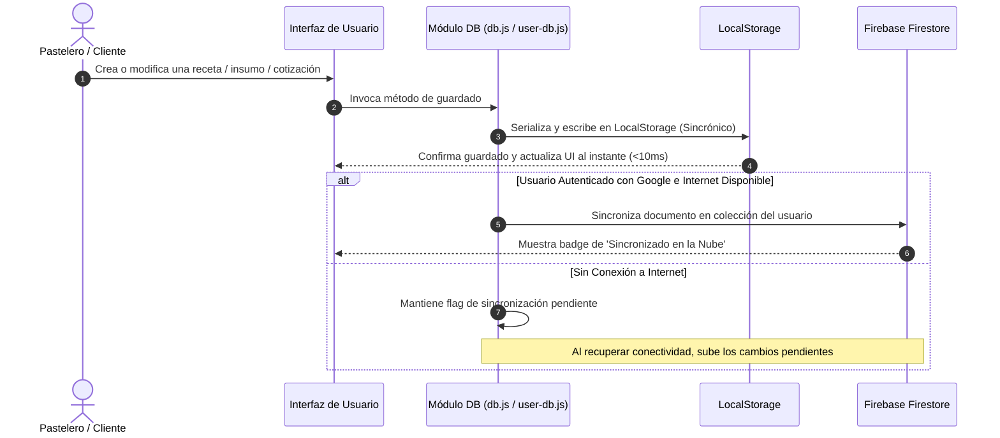
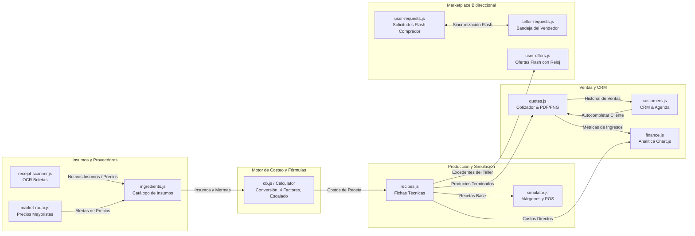
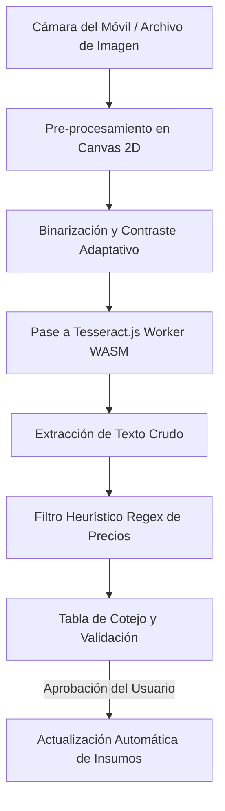
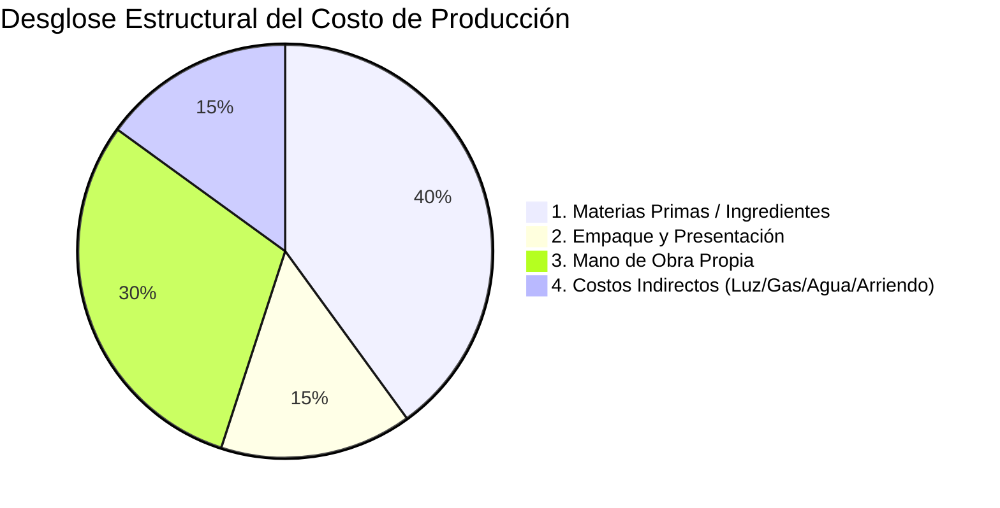
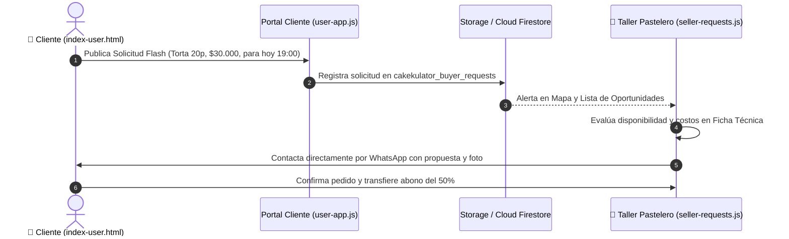

# 🧁 Cakekulator & Servikulator - Suite Integral de Costos, Gestión y Marketplace

> **Plataforma Integral de Gestión Comercial, Costeo Gastronómico de Alta Precisión (4 Factores), Simulación Financiera, CRM de Clientes, OCR de Boletas y Marketplace Local para Emprendedores de Pastelería y Servicios.**

[](https://developer.mozilla.org/es/docs/Web/Progressive_web_apps)
[](https://developer.mozilla.org/es/docs/Web/JavaScript)
[](https://tailwindcss.com/)
[](https://firebase.google.com/)
[](https://leafletjs.com/)
[](https://tesseract.projectnaptha.com/)
[](LICENSE)

---

## 📑 Tabla de Contenidos

1. [Visión General y Propósito del Proyecto](#-visión-general-y-propósito-del-proyecto)
2. [Ecosistema y Puntos de Acceso (Las 4 Caras de Cakekulator)](#-ecosistema-y-puntos-de-acceso-las-4-caras-de-cakekulator)
3. [Tecnologías Utilizadas y Cómo Funcionan Internamente](#-tecnologías-utilizadas-y-cómo-funcionan-internamente)
   - [3.1 Vanilla JavaScript ES6+ (Arquitectura Modular por Dominios)](#31-vanilla-javascript-es6-arquitectura-modular-por-dominios)
   - [3.2 Tailwind CSS + Design System Híbrido Reactivo](#32-tailwind-css--design-system-híbrido-reactivo)
   - [3.3 PWA, Service Worker y Cache Storage API](#33-pwa-service-worker-y-cache-storage-api)
   - [3.4 Tesseract.js: OCR Local con WebAssembly y Web Workers](#34-tesseractjs-ocr-local-con-webassembly-y-web-workers)
   - [3.5 Motor Documental y Gráfico (html2canvas & html2pdf.js)](#35-motor-documental-y-gráfico-html2canvas--html2pdfjs)
   - [3.6 Cartografía y Geolocalización con Leaflet.js](#36-cartografía-y-geolocalización-con-leafletjs)
   - [3.7 Analítica Visual con Chart.js v4](#37-analítica-visual-con-chartjs-v4)
   - [3.8 Capa de Persistencia Híbrida: LocalStorage + Firebase Firestore](#38-capa-de-persistencia-híbrida-localstorage--firebase-firestore)
4. [Relación entre Elementos y Flujo Integral de Datos](#-relación-entre-elementos-y-flujo-integral-de-datos)
   - [4.1 Diagrama de Interacción entre Módulos](#41-diagrama-de-interacción-entre-módulos)
   - [4.2 Matriz de Producción y Consumo de Datos](#42-matriz-de-producción-y-consumo-de-datos)
   - [4.3 Sistema de Reactividad y Despacho de Eventos](#43-sistema-de-reactividad-y-despacho-de-eventos)
5. [Guía Exhaustiva de Procesos y Funcionalidades](#-guía-exhaustiva-de-procesos-y-funcionalidades)
   - [5.1 Catálogo de Insumos, Conversor Métrico y Cálculo de Merma](#51-catálogo-de-insumos-conversor-métrico-y-cálculo-de-merma)
   - [5.2 Escáner Inteligente OCR de Boletas y Recetas](#52-escáner-inteligente-ocr-de-boletas-y-recetas)
   - [5.3 Fichas Técnicas: El Método Integral de los 4 Factores](#53-fichas-técnicas-el-método-integral-de-los-4-factores)
   - [5.4 Motor de Escalado Inteligente (Porciones y Diámetro)](#54-motor-de-escalado-inteligente-porciones-y-diámetro)
   - [5.5 Simulador Dinámico de Precios, Comisiones POS y Márgenes](#55-simulador-dinámico-de-precios-comisiones-pos-y-márgenes)
   - [5.6 Presupuestos, Cotizaciones y Envío Omnicanal (WhatsApp/PDF/PNG)](#56-presupuestos-cotizaciones-y-envío-omnicanal-whatsapppdfpng)
   - [5.7 CRM de Clientes, Recordatorios y Fechas Especiales](#57-crm-de-clientes-recordatorios-y-fechas-especiales)
   - [5.8 Radar de Ofertas Mayoristas y Monitoreo de Precios](#58-radar-de-ofertas-mayoristas-y-monitoreo-de-precios)
   - [5.9 Portal Marketplace Cliente ⇄ Vendedor (Solicitudes y Ofertas Flash)](#59-portal-marketplace-cliente--vendedor-solicitudes-y-ofertas-flash)
   - [5.10 Modo Dual: Cakekulator (Productos) ⇄ Servikulator (Servicios)](#510-modo-dual-cakekulator-productos--servikulator-servicios)
6. [Diseño Móvil, Jerarquía Visual y Control de Superposiciones](#-diseño-móvil-jerarquía-visual-y-control-de-superposiciones)
7. [Guía de Instalación, Configuración y Despliegue](#-guía-de-instalación-configuración-y-despliegue)
8. [Estructura Detallada de Archivos del Repositorio](#-estructura-detallada-de-archivos-del-repositorio)
9. [Licencia](#-licencia)

---

## 🎯 Visión General y Propósito del Proyecto

En los negocios de repostería artesanal, panaderías gourmet y talleres de servicios personales, el **error de cálculo en los costos reales de producción** es la causa principal de insolvencia o sobreesfuerzo sin rentabilidad. Frecuentemente se cometen tres equivocaciones críticas:

1. **Subcosteo de Materias Primas**: Se ignoran las mermas inevitables (cáscaras de huevos, pelado de frutas, evaporación de cocción) y el costo real derivado de comprar insumos en empaques industriales versus su uso fraccionado en gramos o mililitros.
2. **Ignorar la Mano de Obra Propia y los Costos Indirectos**: El repostero calcula cuánto le costó la harina y el manjar, pero olvida asignarse un salario por hora de trabajo y omitir el costo de gas del horno, electricidad de batidoras, refrigeración y cajas de presentación.
3. **Fricción en la Venta y Falta de Canal Comercial**: Cotizar a mano en papel o notas de celular consume horas diarias, y no existe un puente rápido que conecte a clientes locales que necesitan un pastel con pasteleros con disponibilidad inmediata.

**Cakekulator & Servikulator** unifica en una sola plataforma:
* Un **motor matemático de costeo estricto** de 4 pilares.
* Un **sistema de cotizaciones omnicanal instantáneo** (WhatsApp con formato, tarjeta gráfica `.png` y `.pdf` formal).
* Un **asistente OCR** que digitaliza boletas de compras y recetas antiguas con la cámara del celular.
* Un **CRM de fidelización** con alertas proactivas a 30 días de cumpleaños de clientes.
* Un **Marketplace bidireccional** donde clientes publican solicitudes flash y los pasteleros cercanos postulan propuestas en tiempo real.

---

## 🌐 Ecosistema y Puntos de Acceso (Las 4 Caras de Cakekulator)

El proyecto ofrece 4 interfaces independientes que comparten la misma base de datos, motor de cálculo y lógica de sincronización:

```mermaid
graph TD
    subgraph "1. 💻 Suite Híbrida / Responsive (index.html)"
        W1[Panel General y Métricas Rápidas]
        W2[Cotizador Rápido con Descuento y Abono]
        W3[Gestor de Fichas Técnicas]
        W4[Buscador Inteligente ⌘K]
    end

    subgraph "2. 📱 PWA Móvil para el Taller (index-app.html)"
        M1[Floating Dock Ergonómico Inferior]
        M2[Tarjetas Táctiles de Receta en Cocina]
        M3[Cámara Celular para OCR de Boletas]
        M4[Operación 100% Offline en Taller]
    end

    subgraph "3. 📊 Suite Desktop con Finanzas (index-web.html)"
        F1[Analítica Financiera con Chart.js]
        F2[Evolución Mensual de Ingresos y Costos]
        F3[Radar de Precios Mayoristas en Pantalla Completa]
        F4[Exportación Masiva y Auditoría]
    end

    subgraph "4. 🛍️ Portal Marketplace Clientes (index-user.html)"
        C1[Exploración de Pastelerías por Categoría]
        C2[Mapa Interactivo de Reposteros Locales]
        C3[Publicación de Solicitudes Flash con Presupuesto]
        C4[Ofertas Flash con Cuenta Regresiva]
    end

    subgraph "🔥 Capa de Persistencia y Conectividad Unificada"
        Local[(LocalStorage Sincrónico / Cache Storage PWA)]
        Cloud[Firebase Cloud Firestore Engine]
        Auth[Google Identity Provider & Auth Rules]
    end

    W1 & W2 & W3 & W4 <--> Local
    M1 & M2 & M3 & M4 <--> Local
    F1 & F2 & F3 & F4 <--> Local
    C1 & C2 & C3 & C4 <--> Local
    Local <--> Cloud
    Cloud <--> Auth
```



### Tabla de Rutas y Casos de Uso

| Ruta Web | Archivo Fuente | Propósito y Experiencia de Usuario | Perfil de Usuario |
| :--- | :--- | :--- | :--- |
| `/` o `/index.html` | [`index.html`](file:///c:/Users/psali/OneDrive/Documents/1.%20Agents%20IA/cakekulator-app/index.html) | Suite Principal Híbrida: adaptable automáticamente de escritorio a móvil con dock flotante y drawer lateral. | Pastelero / Administrador |
| `/app` | [`index-app.html`](file:///c:/Users/psali/OneDrive/Documents/1.%20Agents%20IA/cakekulator-app/index-app.html) | Experiencia PWA vertical pura para teléfonos: botones sobredimensionados para usar con guantes o harina, cámara para OCR. | Pastelero en Taller / Cocina |
| `/web` | [`index-web.html`](file:///c:/Users/psali/OneDrive/Documents/1.%20Agents%20IA/cakekulator-app/index-web.html) | Experiencia expandida para monitores grandes: visualización de métricas financieras, desglose de costos y gráficos Chart.js. | Contador / Administrador |
| `/cliente`, `/pedidos`, `/user` | [`index-user.html`](file:///c:/Users/psali/OneDrive/Documents/1.%20Agents%20IA/cakekulator-app/index-user.html) | Portal Marketplace para el público general: descubre pastelerías en mapa, pide presupuestos y reserva ofertas flash. | Compradores / Clientes Finales |

---

## 🛠️ Tecnologías Utilizadas y Cómo Funcionan Internamente

Cakekulator sigue la filosofía **Modern Vanilla & Zero-Build Tooling**. No requiere transpiladores (`Babel`), empaquetadores pesados (`Webpack`, `Vite`) ni carpetas masivas de dependencias en tiempo de ejecución.

```
┌────────────────────────────────────────────────────────────────────────┐
│                        ARQUITECTURA TECNOLÓGICA                        │
├────────────────────────────────────────────────────────────────────────┤
│  PRESENTACIÓN      Tailwind CSS CDN 3.4 + Vanilla Design System (CSS3) │
│  LÓGICA CLIENTE    Vanilla JavaScript ES6+ (Modular Objects Pattern)   │
│  OFFLINE & PWA     Service Worker API + Cache API + Web Manifests      │
│  INTELIGENCIA/OCR  Tesseract.js v5 (WASM Web Workers) + Gemini AI SDK  │
│  DOCUMENTOS/PDF    html2canvas v1.4.1 + html2pdf.js v0.10.1            │
│  MAPAS/GEO         Leaflet.js v1.9.4 + OpenStreetMap Tiles + Haversine │
│  GRÁFICOS          Chart.js v4.4.4 (Canvas 2D Reactivo)                │
│  PERSISTENCIA      LocalStorage Cache + Firebase Firestore v10 (Compat)│
│  AUTENTICACIÓN     Firebase Authentication (Google Identity Provider)  │
│  NOTIFICACIONES    Web Push API + Firebase Cloud Messaging (FCM)      │
└────────────────────────────────────────────────────────────────────────┘
```

### 3.1 Vanilla JavaScript ES6+ (Arquitectura Modular por Dominios)

En lugar de utilizar frameworks monolíticos que agregan una capa de abstracción sobre el DOM (como React o Vue), la aplicación utiliza el **Patrón de Espacios de Nombres Modulares (Namespaced Module Pattern)**. Cada dominio del negocio está encapsulado en un objeto JavaScript global autosuficiente:

```javascript
// Estructura modular estándar de los controladores
const RecipesModule = {
  currentFilter: 'all',
  editingRecipeId: null,

  init() {
    this.bindEvents();
    this.renderRecipeList();
  },

  recalculateLiveSummary() {
    // 1. Lee los inputs del DOM
    // 2. Invoca a Calculator.calculateRecipeFullCosts(...)
    // 3. Actualiza nodos específicos sin destruir el árbol DOM
  }
};
```

#### Ventajas Técnicas:
1. **Tiempo de Carga Inmediato (First Contentful Paint < 200ms)**: El navegador analiza directamente los archivos JavaScript sin pasar por bundles de varios megabytes.
2. **Uso Mínimo de Memoria RAM**: Crucial para teléfonos móviles de gama de entrada utilizados habitualmente en cocinas.
3. **Mantenibilidad Directa**: Cualquier función puede inspeccionarse directamente en las herramientas de desarrollo del navegador (`DevTools`) sin mapas de fuentes (`source-maps`) ofuscados.

---

### 3.2 Tailwind CSS + Design System Híbrido Reactivo

El estilo visual combina utilidades atómicas de Tailwind CSS cargadas por CDN con un sistema de variables CSS personalizadas en [`styles.css`](file:///c:/Users/psali/OneDrive/Documents/1.%20Agents%20IA/cakekulator-app/css/styles.css) y [`user-styles.css`](file:///c:/Users/psali/OneDrive/Documents/1.%20Agents%20IA/cakekulator-app/css/user-styles.css):

* **Variables de Color HSL**: Al alternar de Pastelería a Servicios, se conmuta una sola clase en el elemento `<html>`:
  ```css
  /* Modo Pastelería (Cakekulator) */
  :root {
    --primary-color: #f43f5e;     /* Rose-500 */
    --primary-light: #fff1f2;     /* Rose-50 */
    --accent-color: #fb7185;      /* Rose-400 */
  }

  /* Modo Estética / Servicios (Servikulator) */
  html.services-mode {
    --primary-color: #0d9488;     /* Teal-600 */
    --primary-light: #f0fdfa;     /* Teal-50 */
    --accent-color: #14b8a6;      /* Teal-500 */
  }
  ```
* **Aceleración por Hardware (GPU)**: Se aplican transformaciones 3D (`transform: translate3d(0, 0, 0)`) en elementos interactivos como la barra dock inferior y tarjetas táctiles para asegurar animaciones a 60 FPS sin caídas de cuadros (*jank*).
* **Modo Oscuro Integrado**: Soporte completo para el selector `dark:` de Tailwind mediante clases y detección de preferencias del sistema operativo (`prefers-color-scheme`).

---

### 3.3 PWA, Service Worker y Cache Storage API

La aplicación es una **Progressive Web App (PWA)** completa regida por [`sw.js`](file:///c:/Users/psali/OneDrive/Documents/1.%20Agents%20IA/cakekulator-app/sw.js):

* **Estrategia Network-First con Cache Fallback**:
  Cuando el usuario interactúa con la aplicación, el Service Worker intenta obtener el recurso más reciente desde la red. Si el servidor responde exitosamente, actualiza la caché local automáticamente. Si no hay conexión (ej. en una cocina con mala señal), responde de inmediato desde la caché local sin mostrar la pantalla de dinosaurio sin internet.
* **Pre-Caché de 42 Activos Esenciales**: Durante el evento `install`, el Service Worker descarga y almacena en caché todos los archivos HTML, estilos CSS, controladores JS, iconos y favicons.
* **Manifiestos Múltiples**:
  * [`manifest.json`](file:///c:/Users/psali/OneDrive/Documents/1.%20Agents%20IA/cakekulator-app/manifest.json): Para la versión escritorio/híbrida.
  * [`manifest-app.json`](file:///c:/Users/psali/OneDrive/Documents/1.%20Agents%20IA/cakekulator-app/manifest-app.json): Para la app móvil del pastelero.
  * [`manifest-user.json`](file:///c:/Users/psali/OneDrive/Documents/1.%20Agents%20IA/cakekulator-app/manifest-user.json): Para la app de clientes.
  Esto permite tener instaladas ambas aplicaciones como accesos directos independientes en la pantalla de inicio del mismo celular.

---

### 3.4 Tesseract.js: OCR Local con WebAssembly y Web Workers

El módulo de digitalización ([`receipt-scanner.js`](file:///c:/Users/psali/OneDrive/Documents/1.%20Agents%20IA/cakekulator-app/js/receipt-scanner.js) y [`recipe-scanner.js`](file:///c:/Users/psali/OneDrive/Documents/1.%20Agents%20IA/cakekulator-app/js/recipe-scanner.js)) utiliza **Tesseract.js v5**:

```
[Cámara / Galería] ──> [Canvas 2D: Grayscale + Binarización] ──> [Web Worker Tesseract.js]
                                                                        │
[Líneas de Compra] <── [Regex Parser: Productos y Precios $] <── [Texto Crudo WASM]
```

1. **Pre-procesamiento en Canvas 2D**: La foto capturada se dibuja en un canvas virtual donde se transforma a escala de grises y se aumenta el contraste local para que la tinta térmica de boletas de supermercado sea fácilmente legible.
2. **Ejecución Asíncrona en Web Worker**: El análisis óptico se realiza en un hilo de ejecución secundario provisto por WebAssembly (`tesseract-core.wasm`). Esto previene el congelamiento de la interfaz de usuario mientras se procesa la imagen.
3. **Parseo Semántico por Regex**: Expresiones regulares heurísticas buscan patrones de moneda chilena (ej. `$ 2.490` o `2490`) asociados a nombres de insumos comerciales para sugerir la actualización de precios en el catálogo con un solo clic.

---

### 3.5 Motor Documental y Gráfico (html2canvas & html2pdf.js)

En [`quotes.js`](file:///c:/Users/psali/OneDrive/Documents/1.%20Agents%20IA/cakekulator-app/js/quotes.js) se implementan dos mecanismos de exportación:

* **Tarjeta Gráfica para WhatsApp (`html2canvas`)**:
  Convierte un nodo del DOM que contiene la tarjeta del presupuesto en un canvas HTML5 con un multiplicador de resolución (`scale: 2`), exportándolo como un archivo `.png` nítido para ser compartido por redes sociales o guardado en el carrete del móvil.
* **Comprobante Formal en PDF (`html2pdf.js`)**:
  Genera un documento PDF vectorial estándar de tamaño Carta/A4 con saltos de página inteligentes, encabezado corporativo del taller y desglose de condiciones comerciales.

---

### 3.6 Cartografía y Geolocalización con Leaflet.js

Tanto el radar mayorista ([`market-radar.js`](file:///c:/Users/psali/OneDrive/Documents/1.%20Agents%20IA/cakekulator-app/js/market-radar.js)) como el mapa de clientes ([`user-map.js`](file:///c:/Users/psali/OneDrive/Documents/1.%20Agents%20IA/cakekulator-app/js/user-map.js)) utilizan **Leaflet.js v1.9.4** con teselas de **OpenStreetMap**:

* **Cero Costos de API**: No requiere tarjetas de crédito ni cuotas de pago como las APIs de Google Maps.
* **Cálculo Esférico con Fórmula de Haversine**:
  Permite determinar con exactitud milimétrica la distancia en línea recta entre la ubicación GPS del cliente y el taller del pastelero:
  $$d = 2R \cdot \arcsin\left(\sqrt{\sin^2\left(\frac{\Delta \varphi}{2}\right) + \cos(\varphi_1)\cos(\varphi_2)\sin^2\left(\frac{\Delta \lambda}{2}\right)}\right)$$
  Donde $R = 6371\text{ km}$ (radio terrestre), $\varphi$ es la latitud y $\lambda$ es la longitud en radianes.

---

### 3.7 Analítica Visual con Chart.js v4

En [`finance.js`](file:///c:/Users/psali/OneDrive/Documents/1.%20Agents%20IA/cakekulator-app/js/finance.js) se implementa un cuadro de mando financiero:
* **Gráfico de Dona de Estructura de Costos**: Desglosa visualmente el porcentaje correspondiente a Insumos, Empaque, Mano de Obra y Costos Indirectos.
* **Gráfico de Barras de Utilidades Mensuales**: Compara ingresos brutos contra costos reales y ganancia neta mes a mes.
* **Destrucción y Redibujado Seguro**: Implementa control de ciclo de vida (`chart.destroy()`) para prevenir fugas de memoria al cambiar de vista o redimensionar la ventana.

---

### 3.8 Capa de Persistencia Híbrida: LocalStorage + Firebase Firestore

El sistema adopta el principio **Offline-First**:



* **Cero Espera**: La lectura y escritura ocurren de forma síncrona en `localStorage`. La interfaz nunca se bloquea con estados de carga ("spinners") innecesarios.
* **Esquema de Documentos en Firestore**:
  * `/users/{uid}/settings`: Configuración general, tarifa horaria y márgenes.
  * `/users/{uid}/ingredients`: Catálogo completo de insumos y mermas.
  * `/users/{uid}/recipes`: Fichas técnicas de recetas.
  * `/users/{uid}/quotes`: Historial de cotizaciones emitidas.
  * `/users/{uid}/customers`: Cartera de clientes y fechas especiales.
  * `/marketplace/requests`: Solicitudes flash públicas emitidas por clientes.

---

## 🔄 Relación entre Elementos y Flujo Integral de Datos

### 4.1 Diagrama de Interacción entre Módulos



---

### 4.2 Matriz de Producción y Consumo de Datos

| Módulo Productor | Estructura de Datos Producida | Módulos Consumidores | Propósito del Consumo |
| :--- | :--- | :--- | :--- |
| [`ingredients.js`](file:///c:/Users/psali/OneDrive/Documents/1.%20Agents%20IA/cakekulator-app/js/ingredients.js) | Lista de Insumos (`packagePrice`, `packageQty`, `packageUnit`, `yieldWastePercent`) | [`recipes.js`](file:///c:/Users/psali/OneDrive/Documents/1.%20Agents%20IA/cakekulator-app/js/recipes.js), [`receipts.js`](file:///c:/Users/psali/OneDrive/Documents/1.%20Agents%20IA/cakekulator-app/js/receipts.js), [`market-radar.js`](file:///c:/Users/psali/OneDrive/Documents/1.%20Agents%20IA/cakekulator-app/js/market-radar.js) | Cálculo de costo neto por gramo/ml en recetas; auditoría de aumentos de precio. |
| [`recipes.js`](file:///c:/Users/psali/OneDrive/Documents/1.%20Agents%20IA/cakekulator-app/js/recipes.js) | Fichas Técnicas (`ingredients`, `packaging`, `laborHours`, `overheadCost`, `yieldPortions`) | [`quotes.js`](file:///c:/Users/psali/OneDrive/Documents/1.%20Agents%20IA/cakekulator-app/js/quotes.js), [`simulator.js`](file:///c:/Users/psali/OneDrive/Documents/1.%20Agents%20IA/cakekulator-app/js/simulator.js), [`finance.js`](file:///c:/Users/psali/OneDrive/Documents/1.%20Agents%20IA/cakekulator-app/js/finance.js) | Agregado de productos en presupuestos; simulación de margen deseado; cálculo de costo de venta. |
| [`quotes.js`](file:///c:/Users/psali/OneDrive/Documents/1.%20Agents%20IA/cakekulator-app/js/quotes.js) | Presupuestos (`items`, `discountPct`, `depositPct`, `totalAmount`, `status`) | [`customers.js`](file:///c:/Users/psali/OneDrive/Documents/1.%20Agents%20IA/cakekulator-app/js/customers.js), [`finance.js`](file:///c:/Users/psali/OneDrive/Documents/1.%20Agents%20IA/cakekulator-app/js/finance.js) | Actualización del valor de vida (*LTV*) del cliente; registro de ingresos cobrados en finanzas. |
| [`tutorial.js`](file:///c:/Users/psali/OneDrive/Documents/1.%20Agents%20IA/cakekulator-app/js/tutorial.js) | Tutorial Guiado Interactivo con Spotlight (`baseSteps`, máscara SVG cutout, halo neón pulsante, tarjeta flotante anclada dinámicamente) | [`app.js`](file:///c:/Users/psali/OneDrive/Documents/1.%20Agents%20IA/cakekulator-app/js/app.js) | Ilumina en pantalla las zonas y botones clave de cada función con explicaciones prácticas, minimizable a pill flotante y reanudable desde Ajustes. |
| [`user-requests.js`](file:///c:/Users/psali/OneDrive/Documents/1.%20Agents%20IA/cakekulator-app/js/user-requests.js) | Solicitudes Flash (`category`, `budget`, `portions`, `dueDate`, `clientPhone`) | [`seller-requests.js`](file:///c:/Users/psali/OneDrive/Documents/1.%20Agents%20IA/cakekulator-app/js/seller-requests.js) | Notificación en el mapa de oportunidades del pastelero para responder cotizaciones. |

---

### 4.3 Sistema de Reactividad y Despacho de Eventos

La sincronización entre componentes sin recargar la página se logra mediante un flujo reactivo unidireccional:

1. **Hash Routing SPA (`app.js`)**: El navegador escucha el evento `hashchange` (ej. `#/recipes`, `#/quotes`, `#/simulator`). Al cambiar el hash, la función `App.navigate(hash)` oculta las secciones inactivas y muestra la sección solicitada mediante transiciones CSS.
2. **Métodos `recalculate...LiveSummary()`**: Cuando el usuario escribe una cantidad en un campo numérico (ej. horas de mano de obra o tarifa), el evento `oninput` dispara el recálculo en vivo sin esperar al guardado formal.
3. **Persistencia y Emisión**: Al presionar "Guardar", el método escribe en `localStorage` y actualiza la lista en pantalla instantáneamente.

---

## 📖 Guía Exhaustiva de Procesos y Funcionalidades

### 5.1 Catálogo de Insumos, Conversor Métrico y Cálculo de Merma

El módulo [`ingredients.js`](file:///c:/Users/psali/OneDrive/Documents/1.%20Agents%20IA/cakekulator-app/js/ingredients.js) permite registrar todas las materias primas del negocio.

#### Conversor Inteligente de Unidades (`Calculator.convertQuantity`)
Admite unidades de masa, volumen y conteo unitario:
* **Masa (Base en gramos `g`)**: `kg` ($\times 1000$), `mg` ($\times 0.001$), `oz` ($\times 28.3495$), `lb` ($\times 453.592$).
* **Volumen (Base en mililitros `ml`)**: `l` / `L` ($\times 1000$), `cc` ($\times 1$), `cup` / taza ($\times 240$), `tbsp` / cucharada ($\times 15$), `tsp` / cucharadita ($\times 5$).
* **Conteo Unitario (Base en unidades `u`)**: `u` / `un` ($\times 1$), `docena` ($\times 12$), `par` ($\times 2$).

#### Fórmula Matemática de Costo con Merma
Cuando se compra un producto que sufre merma al ser procesado (ej. frutillas que se deshojan, chocolate que queda adherido en el bowl o nueces con cáscara), el insumo rinde menos de lo que pesa en el paquete original. El motor calcula el **Costo Real por Unidad Base**:

$$\text{Cantidad Neta Efectiva} = \text{Cantidad Comprada} \times \left(1 - \frac{\text{Merma \%}}{100}\right)$$

$$\text{Costo Unitario Efectivo} = \frac{\text{Precio de Compra}}{\text{Cantidad Neta Efectiva}}$$

**Ejemplo Práctico**:
* Se compra 1 kg (1000 g) de frutillas a **$3.500**.
* La merma estimada al deshojar y lavar es del **15%**.
* La cantidad neta útil es $1000 \times (1 - 0.15) = 850\text{ g}$.
* El costo por gramo real pasa de **$3.50/g** a $\frac{\$3.500}{850} = \mathbf{\$4.12/g}$.
* Al usar 300 g en una torta, el sistema cobrará $\$1.235$ en vez de $\$1.050$, protegiendo el margen del negocio.

---

### 5.2 Escáner Inteligente OCR de Boletas y Recetas

Integrado en [`receipt-scanner.js`](file:///c:/Users/psali/OneDrive/Documents/1.%20Agents%20IA/cakekulator-app/js/receipt-scanner.js) y [`recipe-scanner.js`](file:///c:/Users/psali/OneDrive/Documents/1.%20Agents%20IA/cakekulator-app/js/recipe-scanner.js):



1. **Captura Rápida**: Acceso directo a la cámara desde el botón flotante en la vista de insumos.
2. **Procesamiento de Tinta Térmica**: Algoritmo de binarización adaptativo que rescata letras desvaídas de impresoras térmicas comerciales.
3. **Mapeo Inteligente**: Si la boleta dice `HARINA SELECTA 1KG $1.490`, el sistema busca si existe un insumo llamado "Harina" en el catálogo y propone actualizar su precio inmediatamente.

---

### 5.3 Fichas Técnicas: El Método Integral de los 4 Factores

El núcleo de costeo en [`db.js`](file:///c:/Users/psali/OneDrive/Documents/1.%20Agents%20IA/cakekulator-app/js/db.js) implementa el estándar profesional de 4 factores de producción:



$$\text{Costo Total del Lote} = C_{\text{ingredientes}} + C_{\text{empaque}} + (\text{Horas Trabajadas} \times \text{Tarifa Horaria}) + \text{Costos Indirectos}$$

#### Métricas Derivadas:
* **Costo por Porción**: $\text{Costo Total} / \text{Porciones de Rendimiento}$.
* **Costo por Unidad**: $\text{Costo Total} / \text{Unidades Producidas}$.
* **Costo Primo Directo**: $(\text{Insumos} + \text{Empaque}) / \text{Unidades}$.
* **Precio de Venta Sugerido**:
  $$\text{Precio Sugerido} = \text{RedondearAl100}\left(\frac{\text{Costo Total Lote}}{1 - (\text{Margen Deseado \%} / 100)}\right)$$

---

### 5.4 Motor de Escalado Inteligente (Porciones y Diámetro)

Permite transformar una receta formulada para un tamaño estándar a cualquier requerimiento de pedido sin errores matemáticos:

#### 1. Escalado por Porciones (Lineal)
Usado para cupcakes, galletas o tortas cuando se conoce la cantidad de personas:
$$\text{Factor de Escala } (F) = \frac{\text{Porciones Objetivo}}{\text{Porciones Base}}$$

#### 2. Escalado por Diámetro de Molde (Cuadrático por Superficie)
En moldes circulares, duplicar el diámetro no duplica la cantidad de masa, ¡la cuadruplica! Cakekulator aplica la relación de áreas de círculos ($\pi r^2$):
$$\text{Factor de Escala } (F) = \left(\frac{\text{Diámetro Objetivo (cm)}}{\text{Diámetro Base (cm)}}\right)^2$$

*Ejemplo*: Si la receta base es para un molde de 18 cm y el cliente pide una torta en molde de 26 cm:
$$F = \left(\frac{26}{18}\right)^2 = 1.444^2 \approx \mathbf{2.086}$$
Se requiere **2.086 veces más masa y relleno**, no 1.44 veces.

#### 3. Atenuación del Factor de Esfuerzo en Mano de Obra ($F^{0.75}$)
Producir una torta el doble de grande no toma el doble de tiempo de batido y horneado. El sistema aplica una curva de atenuación:
$$\text{Horas Escaladas} = \text{Horas Base} \times F^{0.75}$$
$$\text{Costos Indirectos Escalados} = \text{Indirectos Base} \times F^{0.80}$$
Esto previene cotizaciones con sobreprecios irreales que alejen a los clientes en pedidos grandes.

---

### 5.5 Simulador Dinámico de Precios, Comisiones POS y Márgenes

Ubicado en [`simulator.js`](file:///c:/Users/psali/OneDrive/Documents/1.%20Agents%20IA/cakekulator-app/js/simulator.js):

* **Margen Real sobre Venta vs Markup sobre Costo**:
  $$\text{Margen \%} = \frac{\text{Precio de Venta} - \text{Costo}}{\text{Precio de Venta}} \times 100$$
  $$\text{Markup \%} = \frac{\text{Precio de Venta} - \text{Costo}}{\text{Costo}} \times 100$$
* **Deducción de Comisiones POS (Transbank / Redelcom / Mercado Pago)**:
  Permite ingresar el porcentaje cobrado por la máquina de tarjetas (ej. 3.19% + IVA):
  $$\text{Comisión Moneda} = \text{Precio de Venta} \times \left(\frac{\text{Comisión \%}}{100}\right)$$
  $$\text{Ingreso Líquido de Bolsillo} = \text{Precio de Venta} - \text{Comisión Moneda}$$
  $$\text{Ganancia Líquida Real} = \text{Ingreso Líquido} - \text{Costo Total}$$

---

### 5.6 Presupuestos, Cotizaciones y Envío Omnicanal (WhatsApp/PDF/PNG)

El módulo [`quotes.js`](file:///c:/Users/psali/OneDrive/Documents/1.%20Agents%20IA/cakekulator-app/js/quotes.js) resuelve el proceso comercial en menos de un minuto:

1. **Construcción del Pedido**: Selección de recetas del catálogo con ajuste en vivo de cantidades, porciones y precios unitarios.
2. **Descuentos Comerciales y Abono de Reserva**:
   * Cálculo de descuento en porcentaje.
   * Cálculo del **50% de abono obligatorio para agendar**, mostrando con claridad:
     * **Total del Pedido**: `$ 45.000`
     * **Abono para Reservar (50%)**: `$ 22.500`
     * **Saldo Contra Entrega**: `$ 22.500`
3. **Tres Canales de Salida Omnicanal**:
   * **📲 Mensaje de WhatsApp**: Mensaje estructurado con emojis y negritas generado con `encodeURIComponent` y disparado por URL scheme `https://wa.me/{telefono}?text=...`.
   * **🖼️ Tarjeta Gráfica en PNG**: Renderizada con `html2canvas` para compartir visualmente por chat o Instagram Direct.
   * **📄 Documento PDF Formal**: Generado en formato vectorial con `html2pdf.js`, ideal para eventos corporativos y matrimonios.

---

### 5.7 CRM de Clientes, Recordatorios y Fechas Especiales

El módulo [`customers.js`](file:///c:/Users/psali/OneDrive/Documents/1.%20Agents%20IA/cakekulator-app/js/customers.js) transforma compradores ocasionales en clientes recurrentes:

* **Métricas de Valor de Vida (*LTV*)**: Monitorea el gasto acumulado del cliente y su ticket promedio por pedido.
* **Agenda de Fechas Especiales**: Registra cumpleaños de hijos, aniversarios de matrimonio y celebraciones anuales.
* **Radar Preventivo a 30 Días**: En la pantalla de inicio aparece una tarjeta de alerta con los clientes cuyas celebraciones ocurrirán en el próximo mes, con un botón para enviarles un saludo de preventa por WhatsApp con un solo clic.

---

### 5.8 Radar de Ofertas Mayoristas y Monitoreo de Precios

En [`market-radar.js`](file:///c:/Users/psali/OneDrive/Documents/1.%20Agents%20IA/cakekulator-app/js/market-radar.js):
* **Comparativa de Distribuidores**: Base de datos de precios de supermercados mayoristas y distribuidores locales.
* **Mapa de Tiendas con Leaflet**: Muestra la ubicación geográfica de los locales de abastecimiento para planificar la ruta de compras.
* **Script de Scraping Automatizado (`scraper.py`)**: Script en Python para capturar catálogos web de cadenas comerciales y actualizar los precios de referencia.

---

### 5.9 Portal Marketplace Cliente ⇄ Vendedor (Solicitudes y Ofertas Flash)

Un puente interactivo que conecta al cliente con el taller pastelero:



* **Para el Cliente**: Puede buscar pastelerías por comuna, ver catálogos con fotos reales, publicar una solicitud flash cuando necesita un pastel de última hora y cazar ofertas con descuento.
* **Para el Pastelero**: Recibe notificaciones de clientes en su zona geográfica buscando productos que él tiene la capacidad de producir, abriendo un canal de venta pasivo.
* **Ofertas Flash del Día (`user-offers.js`)**: Permite al pastelero publicar excedentes de producción con un reloj de cuenta regresiva para liquidar stock fresco antes del cierre del día.

---

### 5.10 Modo Dual: Cakekulator (Productos) ⇄ Servikulator (Servicios)

El selector superior permite transformar la aplicación en una suite para negocios de servicios personales (estética, barberías, masajes, cosmetología):

| Característica | 🎂 Modo Cakekulator | 💆 Modo Servikulator |
| :--- | :--- | :--- |
| **Giro Principal** | Pastelería, Panadería, Chocolatería | Barbería, Manicure, Masajes, Estética Facial |
| **Insumos** | Harina, chocolate, mantequilla, moldes | Ampollas, ceras, esmaltes permanentes, aceites |
| **Unidades de Costeo** | Gramos (`g`), Kilos (`kg`), Mililitros (`ml`) | Dosis (`ml`), ampollas (`u`), aplicaciones (`u`) |
| **Presentaciones** | Porciones de torta, unidades de lote | Sesiones de tratamiento, horas de atención |
| **Margen Recomendado**| 35% a 55% | 50% a 75% |
| **Paleta de Colores** | Rosa & Carmín (`--primary-pink`) | Verde Azulado & Menta (`--primary-teal`) |

---

## 📐 Diseño Móvil, Jerarquía Visual y Control de Superposiciones

Para garantizar que en pantallas pequeñas (iPhones con barra *Home Indicator* o celulares Android con botones virtuales) ningún elemento tape a otro, se estableció un sistema de diseño estricto:

```
┌────────────────────────────────────────────────────────┐
│ HEADER FIJO SUPERIOR (z-index: 40)                     │
│ Logo, Nombre de Marca, Switcher Dual y Auth Google     │
├────────────────────────────────────────────────────────┤
│ CONTENIDO PRINCIPAL SCROLLEABLE (#app-main-content)    │
│                                                        │
│ - Padding inferior dinámico de seguridad:              │
│   calc(8rem + env(safe-area-inset-bottom, 24px))       │
│                                                        │
│ [ Tarjeta de Ficha Técnica / Cotización ]             │
│ [ Botón Primario: Escalar ] [ Botón: WhatsApp ]        │
│                                                        │
│ ↓ Franja despejada de protección (30px a 50px)         │
├────────────────────────────────────────────────────────┤
│ FLOATING DOCK INFERIOR (z-index: 40)                   │
│ [🏠 Inicio] [📋 Cotizar] [🎂 Recetas] [📦 Insumos]...  │
└────────────────────────────────────────────────────────┘
```

### 1. Despeje Inferior Dinámico (`Safe Area Insets`)
La barra de navegación flotante (`#mobile-bottom-nav`) mide aproximadamente 68px de alto y flota a 12px del borde inferior. Para que la última tarjeta de la pantalla nunca quede tapada por el dock:
* En [`css/styles.css`](file:///c:/Users/psali/OneDrive/Documents/1.%20Agents%20IA/cakekulator-app/css/styles.css):
  ```css
  body {
    padding-bottom: calc(7.5rem + env(safe-area-inset-bottom, 20px)) !important;
  }
  #app-main-content {
    padding-bottom: calc(8rem + env(safe-area-inset-bottom, 24px)) !important;
  }
  ```

### 2. Jerarquía Estricta de Capas (`z-index`)

```
Nivel 100 ──> Toast de Alertas y Notificaciones (#app-toast, #user-toast)
Nivel 70  ──> Ventanas Modales Completas (quote-modal, customer-modal)
Nivel 50  ──> Menús Desplegables de Búsqueda Rápida y Creación
Nivel 40  ──> Header Fijo Superior y Barra Floating Dock Inferior
Nivel 10  ──> Capas Cartográficas de Leaflet (.leaflet-container)
```
* **Solución de Problema Histórico**: Antes, los modales utilizaban `z-50`, lo que permitía que elementos del dock flotante (`z-40` / `z-50`) compitieran visualmente o se asomaran sobre el fondo oscuro. Al estandarizar los modales en `z-[70]` y los avisos emergentes en `z-[100]`, las capas se aíslan por completo.

### 3. Contención de Diálogos Modales en Viewport Móvil
Todos los modales incorporan:
```html
<div class="max-h-[calc(100dvh-2rem)] flex flex-col">
  <div class="overflow-y-auto flex-1"> ... campos ... </div>
  <div class="shrink-0 p-4 border-t bg-gray-50"> ... botones de acción ... </div>
</div>
```
Esto asegura que al abrirse el teclado virtual en el celular, el pie del modal con los botones **"Guardar"** y **"Cancelar"** permanezca siempre accesible.

---

## 🚀 Guía de Instalación, Configuración y Despliegue

### 1. Requisitos del Entorno
* **Python 3.8+** (recomendado para el servidor local multired).
* Navegador moderno compatible con ES6 Modules y Service Workers (Chrome, Edge, Safari, Firefox).
* Opcional: **Node.js v18+** y `firebase-tools` si se desea utilizar emuladores locales de Firebase.

### 2. Inicio Inmediato con Servidor Local
Clona el repositorio y ejecuta el script del servidor:

```bash
# Navegar al directorio del proyecto
cd cakekulator-app

# Iniciar servidor HTTP multired con detección de IP
python server.py
```

El script detectará tu dirección de red y mostrará:
```
======================================================================
   🧁 Cakekulator Server Activo
   Computadora Local:  http://localhost:8080
   Red Celular Wi-Fi:  http://192.168.1.45:8080
   Portal Clientes:    http://192.168.1.45:8080/index-user.html
======================================================================
```

### 3. Instalación como PWA en Dispositivos Móviles
1. Conecta tu teléfono celular a la **misma red Wi-Fi** de la computadora.
2. Abre la URL en el navegador de tu teléfono:
   * En **Android**: Abre en **Google Chrome** y presiona el banner **"Agregar Cakekulator a la pantalla principal"** o abre el menú de tres puntos $\rightarrow$ **Instalar aplicación**.
   * En **iOS (iPhone)**: Abre en **Safari**, presiona el botón **Compartir** (icono de cuadrado con flecha hacia arriba) $\rightarrow$ **Agregar a pantalla de inicio**.
3. La aplicación se abrirá sin las barras del navegador, con pantalla de inicio (*splash screen*) y funcionamiento sin conexión garantizado.

### 4. Configuración de Firebase Cloud (Opcional)
Para sincronizar datos en la nube entre múltiples dispositivos:
1. Crea un proyecto en [Firebase Console](https://console.firebase.google.com/).
2. Habilita **Authentication** con proveedor **Google**.
3. Habilita base de datos **Cloud Firestore** en modo de producción o prueba.
4. Genera tus credenciales y crea el archivo `js/config.local.js`:

```javascript
window.FIREBASE_CONFIG = {
  apiKey: "TU_API_KEY",
  authDomain: "tu-proyecto.firebaseapp.com",
  projectId: "tu-proyecto",
  storageBucket: "tu-proyecto.appspot.com",
  messagingSenderId: "123456789",
  appId: "tu-app-id"
};
```

### 5. Despliegue en Producción

#### Despliegue en Firebase Hosting:
```bash
# Iniciar sesión y desplegar
npm install -g firebase-tools
firebase login
firebase deploy --only hosting
```

#### Despliegue en Vercel:
El proyecto incluye un archivo [`vercel.json`](file:///c:/Users/psali/OneDrive/Documents/1.%20Agents%20IA/cakekulator-app/vercel.json) preconfigurado con enrutamiento de URLs limpias. Simplemente importa el repositorio en tu panel de Vercel.

---

## 📁 Estructura Detallada de Archivos del Repositorio

```
cakekulator-app/
├── index.html                  # Suite Principal Híbrida (PC / Tablet / Celular)
├── index-app.html              # PWA Móvil del Pastelero (Optimizada para Cocina)
├── index-web.html              # Suite Desktop con Analítica Financiera Chart.js
├── index-user.html             # Portal Marketplace de Clientes y Ofertas Flash
├── manifest.json               # Manifiesto PWA Suite Principal
├── manifest-app.json           # Manifiesto PWA Versión Móvil Taller
├── manifest-user.json          # Manifiesto PWA Versión Portal de Clientes
├── sw.js                       # Service Worker con Estrategia Network-First y Offline
├── firebase-messaging-sw.js    # Service Worker para Notificaciones Push en Segundo Plano
├── firebase.json               # Configuración de Hosting y Enrutamiento de Firebase
├── vercel.json                 # Configuración de Enrutamiento para Vercel
├── server.py                   # Servidor HTTP Local con detección de IP LAN Wi-Fi
├── scraper.py                  # Script Python para escaneo de precios de supermercados
├── package.json                # Metadatos del proyecto y scripts auxiliares
├── MANUAL_DE_USUARIO.md        # Manual operativo extendido paso a paso para el usuario
├── README.md                   # Documentación técnica, arquitectónica y funcional
│
├── css/
│   ├── styles.css              # Hoja de estilos del Pastelero (Dock, HSL, Safe Area)
│   └── user-styles.css         # Hoja de estilos del Portal de Clientes
│
├── js/
│   ├── app.js                  # Router SPA principal, atajos de teclado y eventos
│   ├── auth.js                 # Autenticación con Google y sincronización Firestore
│   ├── config.local.js         # Llaves y credenciales locales (ignorado en git)
│   ├── customers.js            # CRM de clientes, alertas preventivas y WhatsApp
│   ├── db.js                   # DAO de LocalStorage y motor matemático Calculator
│   ├── finance.js              # Analítica financiera con gráficos Chart.js
│   ├── firebase-config.js      # Inicialización y conectividad SDK Firebase
│   ├── gemini-service.js       # Asistente de inteligencia artificial para recetas
│   ├── ingredients.js          # Catálogo de materias primas, conversor y merma
│   ├── market-radar.js         # Radar mayorista, comparador de ahorro y mapa
│   ├── notifications.js        # Gestión de permisos y suscripción a alertas push
│   ├── quotes.js               # Generador de cotizaciones, WhatsApp, PNG y PDF
│   ├── receipt-scanner.js      # Escáner OCR de boletas con Tesseract.js WASM
│   ├── receipts.js             # Módulo de edición de compras e insumos
│   ├── recipe-scanner.js       # Digitalizador OCR de recetas impresas
│   ├── recipes.js              # Fichas técnicas, costeo de 4 factores y escalado
│   ├── seller-requests.js      # Bandeja de solicitudes de clientes recibidas en mapa
│   ├── simulator.js            # Simulador de rentabilidad, comisiones POS y precios
│   ├── templates.js            # Semillas predeterminadas de recetas e insumos
│   ├── tutorial.js             # Tutorial guiado interactivo con spotlight visual, halo neón y cutout mask por botones
│   ├── user-app.js             # Controlador general del Portal de Clientes
│   ├── user-auth.js            # Autenticación y perfil del cliente
│   ├── user-db.js              # Persistencia local del catálogo público y pedidos
│   ├── user-map.js             # Integración con mapa Leaflet para compradores
│   ├── user-offers.js          # Módulo de ofertas flash con temporizador regresivo
│   ├── user-profile.js         # Preferencias dietarias y fechas del cliente
│   └── user-requests.js        # Gestor de publicación de solicitudes flash
│
└── assets/
    └── icons/                  # Recursos gráficos e identidades de marca
        ├── logo.png            # Icono Isométrico 3D App Pastelero
        ├── logo-user.png       # Nuevo Icono Isométrico 3D App Clientes (1024x1024)
        ├── icon-192.png        # Icono PWA Pastelero 192x192
        ├── icon-512.png        # Icono PWA Pastelero 512x512
        ├── icon-user-192.png   # Icono PWA Clientes 192x192
        ├── icon-user-512.png   # Icono PWA Clientes 512x512
        ├── favicon.png         # Favicon Pestaña Pastelero
        └── favicon-user.png    # Favicon Pestaña Clientes
```

---

## 📄 Licencia

Este proyecto está bajo la Licencia **MIT**. Eres libre de utilizarlo, modificarlo, bifurcarlo y distribuirlo tanto para proyectos personales como comerciales.
